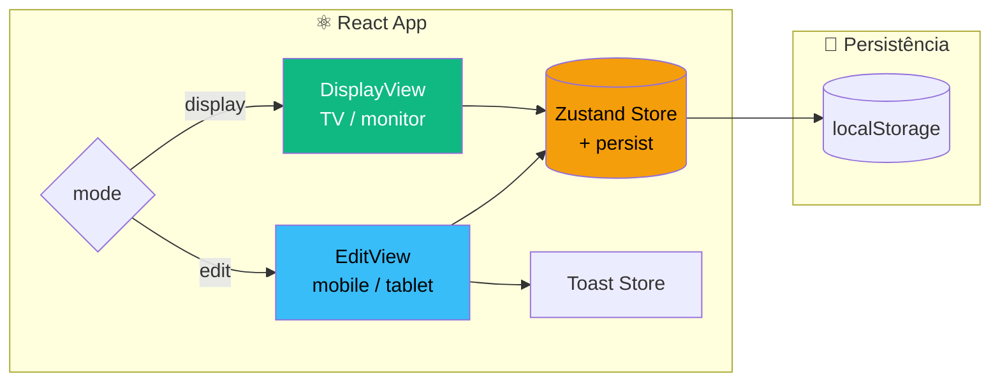

# Training Board

> Painel interativo para personal trainers gerenciarem cronogramas de treino — com modo **Display** para TV na academia e modo **Edit** para celular/tablet.

[](https://training-board-sooty.vercel.app/)


**🌐 Demo:** https://training-board-sooty.vercel.app/

---

## 🇧🇷 Português

### Contexto

Personal trainers montam cronogramas de treino individuais para cada aluno. Durante a aula, precisam consultar rapidamente o que cada aluno vai fazer — e às vezes precisam **alterar na hora** (mudar uma carga, adicionar um exercício, inverter a ordem).

A solução tradicional é um **quadro branco** ou uma **folha impressa** — que não permite edição rápida, não fica legível à distância e não sobrevive a mudanças de última hora.

Este projeto resolve isso com um app que tem **dois modos**:

- **Display** — uma tela grande (TV/monitor) na parede, exibindo os treinos do horário atual. Legível à distância, com escala de fonte ajustável.
- **Edit** — uma tela no celular ou tablet da personal, permitindo editar exercícios em tempo real. As alterações refletem no display.

### Demonstração

**Modo Display** (TV na academia):
- Cards de aluno com nome grande, contador de exercícios e lista numerada
- Cada exercício mostra: nome, equipamento, séries × reps, carga (ou tempo/distância)
- Exercícios destacados aparecem com fundo âmbar
- Observações importantes em itálico
- Abas de horário no topo (ex: 07:00, 08:00, 18:00)
- **Escala ajustável**: 4 níveis (Pequeno / Médio / Grande / Enorme) para diferentes tamanhos de TV

**Modo Edit** (celular/tablet):
- Edição inline de todos os campos (nome, equipamento, séries, reps, medida, notas)
- **Tipo de medida flexível**: carga (kg), tempo (30s, 1 min), distância (5km) ou nenhuma
- Adicionar, remover (com modal de confirmação) e reordenar exercícios
- Destacar exercícios prioritários com um clique
- Toasts de feedback para cada ação

### Arquitetura



### Stack

| Camada | Tecnologia |
|---|---|
| Framework | React 19 |
| Linguagem | TypeScript 6 (strict) |
| Build | Vite 8 |
| Estilização | Tailwind CSS 4 |
| Estado global | Zustand 5 (com middleware `persist`) |
| Animações | Framer Motion |
| Ícones/UI | Componentes próprios |
| Lint | ESLint 10 (flat config) + typescript-eslint |
| Deploy | Vercel |

### Como rodar

```bash
git clone https://github.com/filipethz/training-board.git
cd training-board

npm install
npm run dev
```

Abre em `http://localhost:5173`.

Build de produção:

```bash
npm run build
npm run preview
```

### Estrutura de pastas

```
src/
├── components/
│   ├── ConfirmDialog.tsx   # Modal de confirmação (exclusão)
│   └── Toast.tsx           # Notificações flutuantes
├── stores/
│   └── toastStore.ts       # Store de toasts (Zustand)
├── views/
│   ├── DisplayView.tsx     # Modo TV
│   └── EditView.tsx        # Modo edição
├── data.ts                 # Dados mockados iniciais
├── store.ts                # Store principal (slots, modo, escala) + persist
├── types.ts                # Tipos do domínio
├── App.tsx                 # Shell + alternância de modos
└── main.tsx                # Ponto de entrada
```

### Modelo de domínio

```typescript
type Slot = {                    // Horário (ex: 07:00)
  id: string
  time: string
  students: Student[]
}

type Student = {                 // Aluno
  id: string
  name: string
  exercises: Exercise[]
}

type Exercise = {                // Exercício
  id: string
  name: string
  equipment?: string             // barra, halteres, polia, ...
  sets: string
  reps: string
  measureType: 'load' | 'time' | 'distance' | 'none'
  measureValue?: string          // "30kg", "1 min", "5km"
  notes?: string
  highlighted: boolean
}
```

### Decisões técnicas

**Por que dois modos em vez de um só responsivo?**
A personal usa **dois contextos diferentes**: a TV na parede (só leitura, à distância) e o celular no bolso (edição rápida). Tentar fazer um layout único que sirva para os dois piora ambos. Modos separados permitem otimizar cada um: tipografia grande e hierarquia clara no display; inputs densos e toques grandes no edit.

**Por que Zustand e não Context API?**
O estado aqui é mais complexo: 3 níveis de aninhamento (slots → students → exercises), com mutações imutáveis em cada nível. Zustand oferece seletores eficientes e middleware `persist` — o Context API exigiria mais boilerplate para o mesmo resultado.

**Por que `measureType` separado de `measureValue`?**
Exercícios podem ser medidos por **carga** (`30kg`), **tempo** (`30s`, `1 min`), **distância** (`5km`) ou **nenhum** (ex: peso corporal). Modelar isso como um tipo explícito permite que a UI mostre o campo certo e o display formate corretamente.

**Por que `measureValue` é string e não number?**
Personal escreve valores como `1 min`, `45s`, `até a falha`, `peso corporal`. Forçar number limitaria o vocabulário real.

**Por que localStorage via `persist`?**
No MVP, é a forma mais simples de persistir sem backend. Quando a Etapa 2 chegar (sincronização entre dispositivos), o `persist` pode ser trocado por uma chamada de API sem mudar a interface do store.

### Limitações conhecidas (MVP)

- **Sem sincronização entre dispositivos.** Cada navegador tem seu próprio estado no localStorage. Editar no celular não atualiza o display na TV.
- **Sem backend.** Os dados vivem apenas no navegador.
- **Sem autenticação.** Qualquer pessoa com o link pode usar (mas só afeta o próprio navegador).
- **Sem drag-and-drop ainda.** A reordenação é feita por botões ↑ ↓. `dnd-kit` já está instalado para a próxima iteração.

### Roadmap

- [ ] **Etapa 2 — Backend + sincronização em tempo real** (Node/Go + Postgres + WebSocket)
- [ ] **Sistema de temas** — a personal escolhe cores que combinam com a academia
- [ ] **Nome do app editável** (ex: "Studio Ana Personal")
- [ ] **Drag-and-drop** para reordenar exercícios (dnd-kit já instalado)
- [ ] **Testes** com Vitest + Testing Library
- [ ] **Histórico de treinos** por aluno
- [ ] **Templates** reutilizáveis de treino
- [ ] **PWA / modo offline** (service worker)

### Autor

**Filipe Thomaz** — Software Engineer

- LinkedIn: [linkedin.com/in/filipethz](https://linkedin.com/in/filipethz)
- GitHub: [github.com/filipethz](https://github.com/filipethz)

---

## 🇬🇧 English

### Context

Personal trainers create individual workout schedules for each student. During the session, they need to quickly check what each student is doing — and sometimes need to **change things on the fly** (adjust a load, add an exercise, swap the order).

The traditional solution is a **whiteboard** or a **printed sheet** — which doesn't allow fast editing, isn't readable from a distance, and doesn't survive last-minute changes.

This project solves it with an app that has **two modes**:

- **Display** — a large screen (TV/monitor) on the wall, showing the current time slot's workouts. Readable from a distance, with adjustable font scale.
- **Edit** — a screen on the trainer's phone or tablet, allowing real-time editing. Changes reflect on the display.

### Architecture

Same Mermaid diagram as above.

### Stack

Same as above.

### How to run

Same as above.

### Folder structure

Same as above.

### Domain model

Same as above.

### Technical decisions

Same rationale as the Portuguese section above.

### Known limitations (MVP)

- **No cross-device sync.** Each browser keeps its own state in localStorage.
- **No backend.** Data lives only in the browser.
- **No authentication.** Anyone with the link can use it (affects only their own browser).
- **No drag-and-drop yet.** Reordering uses ↑ ↓ buttons. `dnd-kit` is already installed for the next iteration.

### Roadmap

- [ ] **Stage 2 — Backend + real-time sync** (Node/Go + Postgres + WebSocket)
- [ ] **Theme system** — trainer picks colors matching the gym
- [ ] **Editable app name** (e.g. "Ana's Personal Studio")
- [ ] **Drag-and-drop** for exercise reordering (dnd-kit already installed)
- [ ] **Tests** with Vitest + Testing Library
- [ ] **Workout history** per student
- [ ] **Reusable workout templates**
- [ ] **PWA / offline mode** (service worker)

### Author

**Filipe Thomaz** — Software Engineer

- LinkedIn: [linkedin.com/in/filipethz](https://linkedin.com/in/filipethz)
- GitHub: [github.com/filipethz](https://github.com/filipethz)